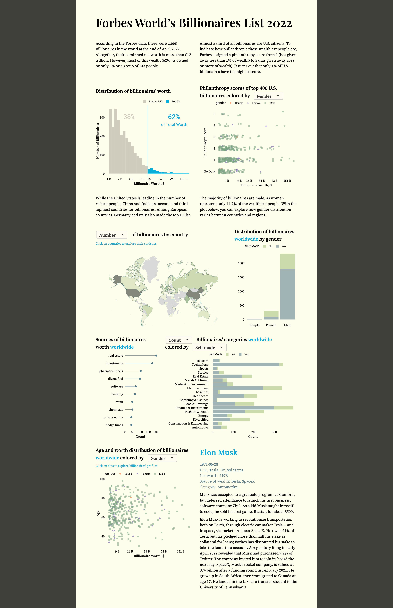

# Forbes World’s Billionaires List 2022: Interactive Shiny Dataviz
Visualization of Forbes World’s Billionaires List 2022 for [the Onyx Data DataDNA – Dataset Challenge](https://onyxdata.co.uk/dataset_challenge/june-2022/)

Web version: https://kor-al.shinyapps.io/forbes-billionaires/

## How to run 
In R (Studio), install all dependencies and use `runApp()` in **forbes-billionaires** directory

